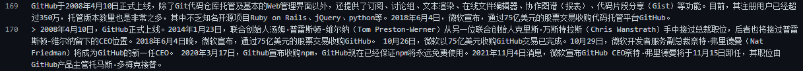

# README.learningnotes.maekdown
GitHub上的README.md的编辑的学习笔记。

README（自述文件）文件的后缀名为md(markdown)，markdown是一种编程式的博客编辑方案，区别于CSDN的可视化的博客编辑器，可能入门比较困难。不过能够来G站扒代码的人估计或多或少都能懂一点编程。GitHub支持的MD语法在标准的markdown语法的基础上做了一些修改，称为GitHub Flavored Markdown（GFM）。

## 目录

* [标题](#标题)
    * 大，中标题与横线
    * 等级表示法
* [文本](#文本)
    * 普通文本
    * 单行文本
    * 多行文本
    * 文字高亮
    * 文字超链接]
    * 斜体、粗体、删除线
* [符号](#符号)
    * 圆点符
* [缩进](#缩进)
* [图片](#图片)
    * 插入网上的图片
    * 插入GitHub仓库里的图片
    * 给图片加上超链接

标题
----
 

### 大，中标题与横线

 
关于在MD中添加标题可以使用连续等于号“===”与连续减号“---”来实现。
如果想要添加一个大标题，就只需要在文本下方加上等于号，等于号的个数可以随便但是一定要大于0。 

 
效果如下：
 

大标题
===
 
同样的，在文本的下方加上减号，就可以添加中标题的效果，对于减号的数量同样没有限制。

效果如下：
 

中标题
---
 
可以发现的是在大标题和中标题之间有一条横线，这就是使用了等于号和减号的标志。而想要不为文本添加标题效果而只显示这条线，就只需要在文本与减号之间补一个空行。用人话讲就是按一个回车空一行。需要注意的是这种用法存在减号的数量限制，必须要使用三个减号以上。可以使用星号“***”和下划线“___”来代替减号（我等于号哭晕在厕所）

效果如下：
 
 
EDG牛逼！！！

---
 
补空行：是很常用的用法，当你不想上下两个不同的布局方式交错到一起的时候，就要在两种布局之间补一个空行。
 

### 等级表示法

 
此外还可以使用等级表示法来表示标题（有那么好的东西我为什么要用等于号？）。等级表示法把标题分为六个等级，文本大小依次递减。使用井号来区分“#”等级，一级标题在文本之前加一个井号，二级标题有两个，以此类推。

效果如下：
 

# 一级标题
## 二级标题
### 三级标题
#### 四级标题
##### 五级标题
###### 六级标题

 
一级标题等于大标题，二级标题等于中标题。这里需要注意的是在井号与文本之间有一个空格。
 

## 文本

 

### 普通文本

 

在编辑器中直接输入的文字就是普通文本，普通文本是不支持换行的，想要换行可以使用\ 标签。\ 是html中的标签，事实上markdown是支持html标签的，但是没有人愿意用html标签来写README.md，至于为什么我不知道，或许可以发个朋友圈问问。 
如果想要显示\ 怎么办，这里就引入了转义，通过在\ 的前边加上反斜杠"\\"就可以实现转义。同理所有的编辑标记都可以通过转义来显示出来。 
效果就像上边这两句话。而在编辑器里边它是这样的:

如果想要显示一个超链接，就直接在编辑器里边打上这个超链接的URL,显示出来就是一个可点击的超链接：www.baidu.com 
 
如果想要显示空格的话就把输入法改成全角再敲一下空格。
 
### 单行文本
在文本之前输入两个tab就可以实现单行文本。 

可以看见单行文本的字体颜色和普通文本的颜色是不一样的，可以很方便的区分。这里需要注意的是单行文本和下面的多行文本之前需要补空行。 
效果如下：

    EDG牛逼！！！
### 多行文本
多行文本和单行文本一样，每一行的前边都有两个tab，方便的是在第一行后边回车直接输入文本就是多行文本了，也就是说不用每一行都去按两下tab。

效果如下：

    EDG牛逼！！！
    很牛逼！！！
    牛逼大了！！！

### 文字高亮

可以使用··把想要突出强调的文字框起来，”·“字符非常冷门百度了一大圈不知道读什么，它不是单引号而是tab键的上边数字1键的左边（注意使用英文输入法）。 

效果如下：

一只`哈巴狗`，趴在`大门口`。
 

### 文字超链接

文字超链接的语法如下：

    [想要添加超链接的文字]（想要添加的超链接 "鼠标悬停文字"）
这里需要注意的一点是鼠标悬停文字的冒号必须是英文输入法的冒号(几乎所有的字符都应该是英文输入法) 
效果如下：

[百度一下](www.baidu.com "百度")，你就知道。 
 
### 斜体、粗体、删除线

 

|语法|效果|
|----|-----|
|`*斜体1*`|*斜体1*|
|`_斜体2_`| _斜体2_|
|`**粗体1**`|**粗体1**|
|`__粗体2__`|__粗体2__|
|`这是一个 ~~删除线~~`|这是一个 ~~删除线~~|
|`***斜粗体1***`|***斜粗体1***|
|`___斜粗体2___`|___斜粗体2___|
|`***~~斜粗体删除线1~~***`|***~~斜粗体删除线1~~***|
|`~~***斜粗体删除线2***~~`|~~***斜粗体删除线2***~~|

符号
---
 

### 圆点符
 
在MD中，输入星号”*“加一个空格就可以达到圆点符的效果。如果不加空格打出来的就是普通星号的效果。

效果如下：

* 姓名：张大炮
* 民族：兽人族
* 学位：大魔导士

想要有分级的效果的话只需要在下一级的星号之前按一个tab，二级是一个，三级是两个，以此类推。

效果如下：

* 紫罗兰国立魔法大学
  * 炼金与魔药工程学院
    * 炼金系

缩进
---

如果是想要分级或者是强调一段文本或者几个关键字，这里可以引入一个缩进的概念。这里直接先看效果。 

> 紫罗兰国立魔法大学
>> 战斗学院
>>> 魔法系
>>>> 火系魔法

这里可以看到显示的一个分级的效果，另外的是引用一段文字或者是引入一段材料，效果是这样的。 
 
GitHub于2008年4月10日正式上线，除了Git代码仓库托管及基本的Web管理界面以外，还提供了订阅、讨论组、文本渲染、在线文件编辑器、协作图谱（报表）、代码片段分享（Gist）等功能。目前，其注册用户已经超过350万，托管版本数量也是非常之多，其中不乏知名开源项目Ruby on Rails、jQuery、python等。2018年6月4日，微软宣布，通过75亿美元的股票交易收购代码托管平台GitHub。
> 2008年4月10日，GitHub正式上线。2014年1月23日，联合创始人汤姆·普雷斯顿-维尔纳（Tom Preston-Werner）从另一位联合创始人克里斯·万斯特拉斯（Chris Wanstrath）手中接过总裁职位，后者也将接过普雷斯顿-维尔纳留下的CEO位置。2018年6月4日晚，微软宣布，通过75亿美元的股票交易收购GitHub。 10月26日，微软以75亿美元收购GitHub交易已完成。10月29日，微软开发者服务副总裁奈特·弗里德曼（Nat Friedman）将成为GitHub的新一任CEO。 2020年3月17日，Github宣布收购npm，GitHub现在已经保证npm将永远免费使用。2021年11月4日消息，微软宣布GitHub CEO奈特·弗里德曼将于11月15日卸任，其职位由GitHub产品主管托马斯·多梅克接替。
 
想要产生这样的效果就只需要在需要缩进的文本前边加上一个大于号">"就好了。就像这样：

和这样：

图片
----
 

### 插入网上的图片

MD中插入图片最基本的语法是：
        
    
    
标识性文字对图片没有影响，真的就只是表示这一句话而已。鼠标悬停文字是你的鼠标悬停在图片上时显示的文字。实例如下：

效果如下：

### 插入GitHub仓库里的图片

插入仓库中的图片和上边插入网上的图片所使用的语法是一样的，不同的是图片的URL是你长裤中图片的URL，相对路径不行的话这边建议用绝对路径比较保险。这里有一个点需要注意的是Github的图片是托管在raw.githubusercontent.com中的，这个网站在国内是打不开的，所以有时候查看README会发现图片加载不出来，这就是DNS污染了。解决的方法就是科学上网或者参考这一篇博文：https://blog.csdn.net/qq_38232598/article/details/91346392 
绝对路径的格式如下：

    https://github.com/你的用户名/你的项目名/blob(参考)/分支名/存放图片的文件夹/该文件夹下的图片

### 给图片加上超链接

想要给图片加上超链接的话这里就需要用到标识性文字了，语法如下：

        [![标识性文字]](指定的超链接)
        --------------------------------
        [标识性文字]:图片URL "鼠标悬停文字"
需要保证链接与图片的标识性文字是一样的

效果如下：

[![baidu]](www.baidu.com)
----------------------------------------------
[baidu]:https://www.baidu.com/img/PCtm_d9c8750bed0b3c7d089fa7d55720d6cf.png "百度logo"

## 此次学习笔记参考博文：https://blog.csdn.net/kaitiren/article/details/38513715
## 该作者在Github上建的一个用来表示具体效果的项目：https://github.com/guodongxiaren/test

